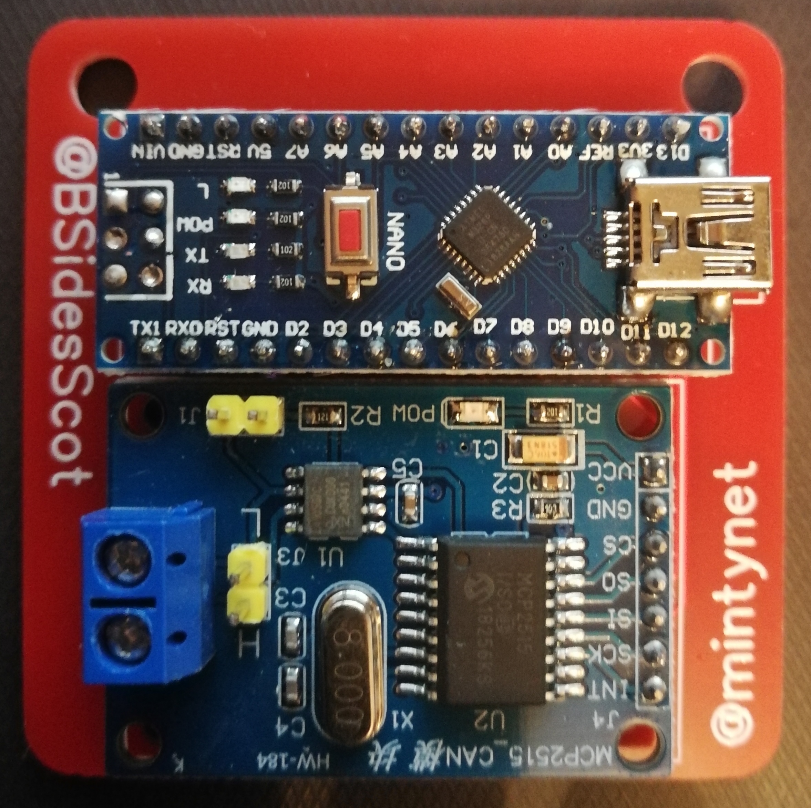
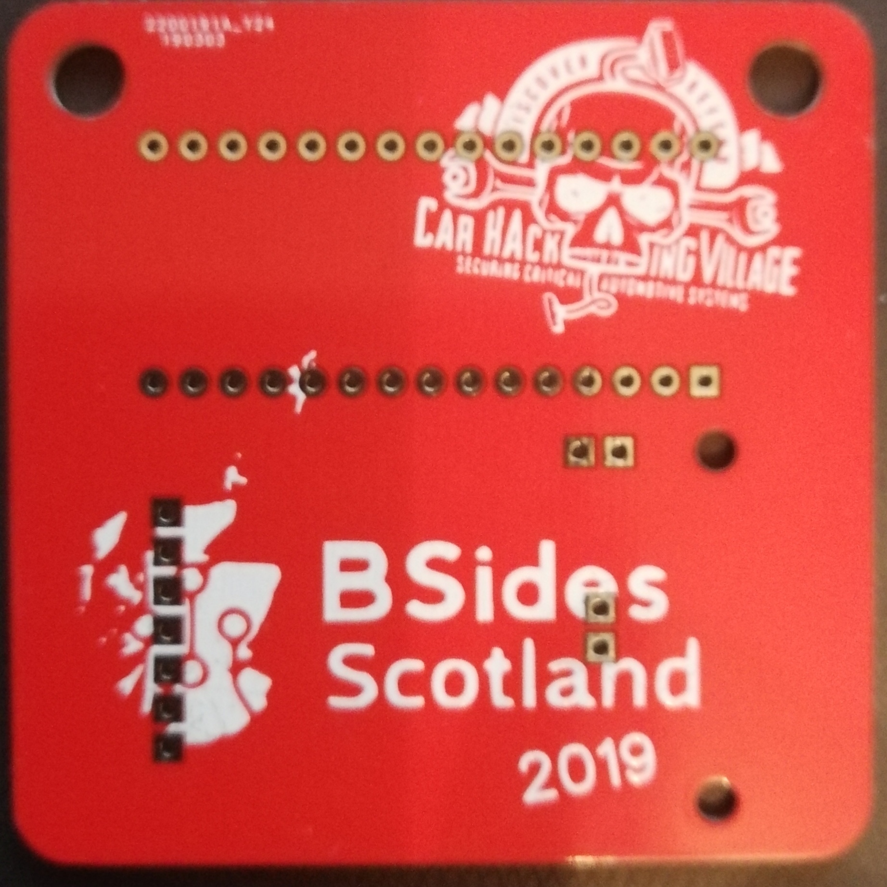
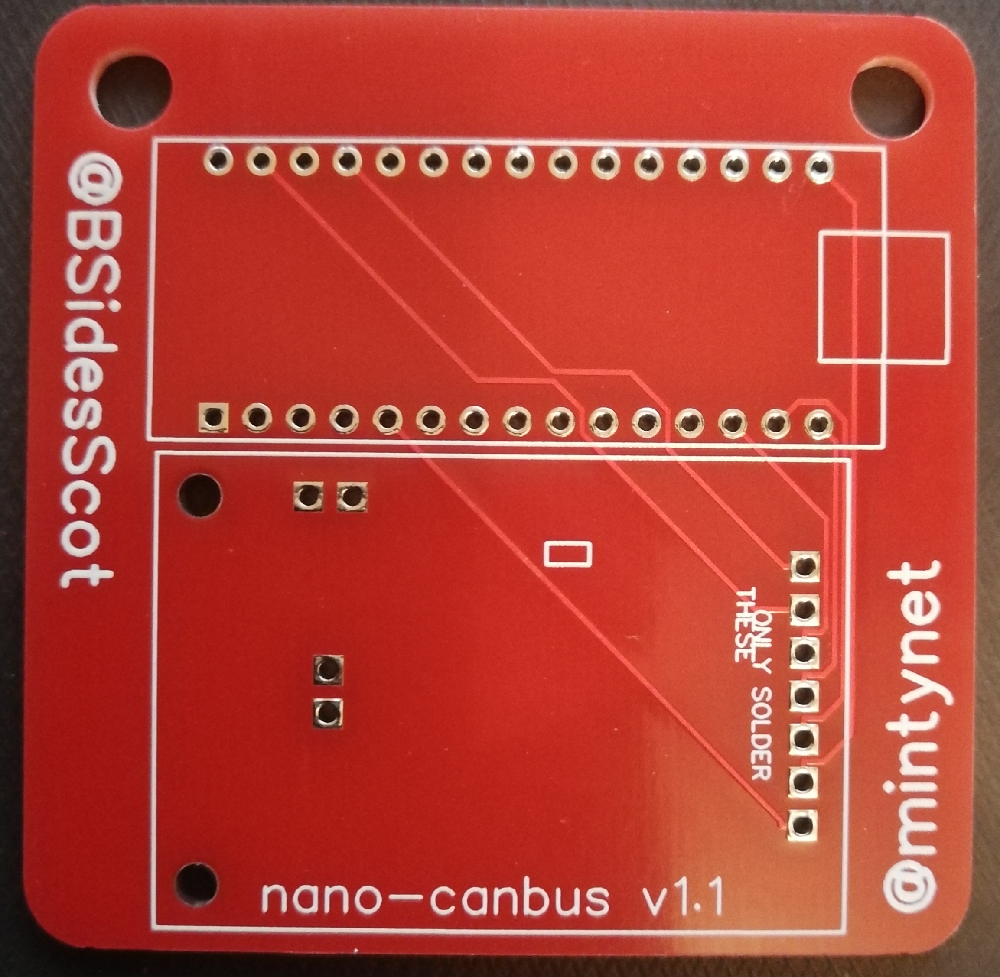

# BSidesScotland2019
Repository for information on the BSides Scotland 2019 / Car Hacking Village UK Badge
 The badge is a cheap device for people to get into car hacking, the sketch that will be below will cause disco mode on PD0 'The Car in a Box'
  <b>BSides Scotland and I take no responsibility for any issues caused if using either the hardware or the code</b>
  Requires the use of the following Arduino library
  https://github.com/coryjfowler/MCP_CAN_lib
  Below is the components which are required to build your own BSides Scotland 2019 Badge
  The components shown below are available from aliexpress/ebay/amazon in that order of cost, but delivery time is probably highest on the cheaper.
 [Arduino Nano](https://www.ebay.co.uk/itm/USB-Nano-V3-0-ATMEGA328P-CH340G-5V-16M-Micro-Controller-Board-For-Arduino/201649419996)
 [MCP2515 Module](https://www.ebay.co.uk/itm/For-Arduino-MCP2515-CAN-Bus-Module-TJA1050-Receiver-SPI-Module/311520457612)
 I have used the above links from alice1101983 myself and delivery is normally 3 weeks to UK
 [OBD2 Plug](https://www.aliexpress.com/item/Car-Diagnostic-Tool-OBD-Male-Plug-16Pin-OBD2-Connector-OBD-2-16-Pin-OBD-II-Adaptor/32790225414.html)
 I have also used the above link, delivery has been varied from 9 to 40 days, but that may because I was ordering bulk.

  https://github.com/mintynet/nano-can has the other sketches for the device.

 <b>Schematic</b>

Note:
 Arduino Nano, the square at one end denote the position of the USB connector.
 <b>TIP</b> Add extra solder to the sides of the USB connector or you may rip the USB connector of the board

 MCP2515 Module goes below the nano but <b>DO NOT</b> solder the Terminator Jumper or CAN pin headers to the PCB
 You may require a jumper on the Terminator resistor if using back to back.
 To solder the CAN module to the board, add extra solder to the back of the pins, then heat the pins and push through so that the pins are on the rear, then remove the plastic pin spacer left on the top and add extra solder to the pins.

 L goes to OBD2 pin 14
 H goes to OBD2 pin 6
 <b>Completed Bottom</b>

 <b>OBD2 connector</b>

 <b>PCB Top</b> 

 <b>PCB Bottom</b> 

